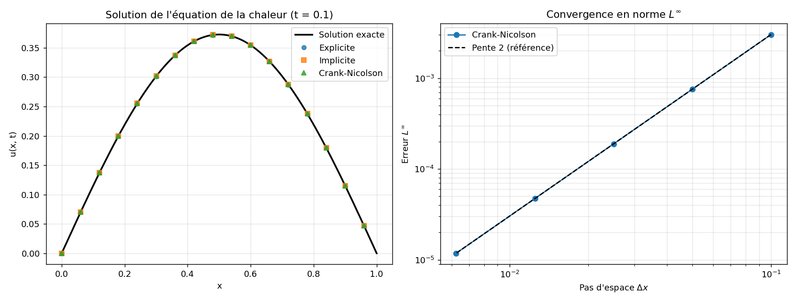

# La Méthode de Crank-Nicolson — Résolution Numérique de l'Équation de la Chaleur

> **Encadré par :** Dr. Souleiman Omar Hoch
> **Réalisé par :** Mikael Ketema Tarekegn, Mohamed Goumaneh Houssein, **Yasser Houssein Hassan** & Youssouf Khaireh Omar
> **Institution :** Université de Djibouti — Faculté des Sciences, Licence de Mathématiques Fondamentales
> **Année universitaire :** 2021 / 2022

Ce projet tutoré est consacré à l'étude théorique et à l'implémentation numérique de la **méthode de Crank-Nicolson** (Crank & Nicolson, 1947) pour la résolution des équations aux dérivées partielles (EDP) paraboliques, illustrée sur l'équation de la chaleur monodimensionnelle.

---

## 1. Cadre mathématique

### 1.1 Classification des EDP linéaires du second ordre

Toute EDP linéaire du second ordre à deux variables s'écrit sous la forme générale :

$$A\, u_{xx} + B\, u_{xy} + C\, u_{yy} + D\, u_x + E\, u_y + F\, u = G(x, y).$$

Sa nature est déterminée par le **discriminant** $\Delta = B^2 - 4AC$ :

| Type | Condition | Exemple canonique | Phénomène physique |
|---|---|---|---|
| **Hyperbolique** | $B^2 - 4AC > 0$ | $u_{tt} = c^2 u_{xx}$ | Propagation d'ondes |
| **Parabolique** | $B^2 - 4AC = 0$ | $u_t = \alpha\, u_{xx}$ | Diffusion / chaleur |
| **Elliptique** | $B^2 - 4AC < 0$ | $u_{xx} + u_{yy} = 0$ | Équilibre / potentiel |

### 1.2 Problème de référence

On considère le problème de Dirichlet pour l'équation de la chaleur normalisée :

$$\frac{\partial u}{\partial t} = \frac{\partial^2 u}{\partial x^2}, \qquad x \in (0,1),\ t > 0,$$

$$u(0,t) = u(1,t) = 0 \quad \text{(Dirichlet homogène)}, \qquad u(x,0) = \sin(\pi x).$$

La **solution analytique exacte**, obtenue par séparation de variables, sert de référence pour évaluer la précision des schémas :

$$\boxed{\,u(x,t) = e^{-\pi^2 t}\,\sin(\pi x)\,}$$

---

## 2. Schémas aux différences finies

On discrétise le domaine sur un maillage régulier $x_i = i\,\Delta x$ ($i = 0,\dots,N_x$) et $t_n = n\,\Delta t$. On note $u_i^n \approx u(x_i, t_n)$ et le **nombre de Fourier** :

$$r = \frac{\Delta t}{\Delta x^2}.$$

### 2.1 Schéma explicite (Euler progressif)

$$u_i^{n+1} = u_i^n + r\left(u_{i+1}^n - 2u_i^n + u_{i-1}^n\right).$$

Précision $O(\Delta t + \Delta x^2)$, **conditionnellement stable** : $r \leq \tfrac{1}{2}$ (condition CFL parabolique).

### 2.2 Schéma implicite (Euler rétrograde)

$$-r\,u_{i-1}^{n+1} + (1+2r)\,u_i^{n+1} - r\,u_{i+1}^{n+1} = u_i^n.$$

**Inconditionnellement stable**, mais requiert la résolution d'un système tridiagonal à chaque pas.

### 2.3 Schéma de Crank-Nicolson

Moyenne arithmétique (θ = ½) des schémas explicite et implicite, centrée en $t_{n+1/2}$ :

$$-\frac{r}{2}u_{i-1}^{n+1} + (1+r)\,u_i^{n+1} - \frac{r}{2}u_{i+1}^{n+1} = \frac{r}{2}u_{i-1}^{n} + (1-r)\,u_i^{n} + \frac{r}{2}u_{i+1}^{n}.$$

| Propriété | Crank-Nicolson |
|---|---|
| Précision | $O(\Delta t^2 + \Delta x^2)$ |
| Stabilité | Inconditionnelle (tout $r > 0$) |
| Structure linéaire | Système **tridiagonal** (algorithme de Thomas, $O(N)$) |
| Limitation | Oscillations possibles si $\Delta t \gg \Delta x$ |

---

## 3. Analyse numérique des schémas

La qualité d'un schéma se juge selon trois propriétés liées par le **théorème d'équivalence de Lax** :

$$\text{Consistance} + \text{Stabilité} \;\Longleftrightarrow\; \text{Convergence}.$$

- **Consistance** : l'erreur de troncature locale tend vers 0 quand $\Delta x, \Delta t \to 0$ (développement de Taylor).
- **Stabilité** (norme $L^\infty$ ou analyse de von Neumann) : les erreurs ne s'amplifient pas au cours du temps.
- **Convergence** : la solution numérique tend vers la solution exacte.

---

## 4. Présentation du code Python

L'implémentation de référence (historiquement en Matlab dans le rapport) est portée en **Python** dans **`crank_nicolson.py`**, qui résout le système tridiagonal via `scipy.linalg.solve_banded` (équivalent vectorisé de l'algorithme de Thomas).

### 4.1 Cœur du schéma de Crank-Nicolson

```python
import numpy as np
from scipy.linalg import solve_banded

def schema_crank_nicolson(nx, nt, T=0.1):
    dx, dt = 1.0 / nx, T / nt
    r = dt / dx**2
    x = np.linspace(0, 1, nx + 1)
    u = np.sin(np.pi * x)              # condition initiale

    m = nx - 1                          # inconnues internes
    diag = (1 + r) * np.ones(m)
    sub  = -r / 2 * np.ones(m)
    sup  = -r / 2 * np.ones(m)

    for _ in range(nt):
        ui = u[1:-1]
        b = (1 - r) * ui                # partie explicite (second membre)
        b[1:]  += r / 2 * ui[:-1]
        b[:-1] += r / 2 * ui[1:]
        u[1:-1] = _resoudre_tridiagonal(sub, diag, sup, b)
        u[0] = u[-1] = 0.0              # Dirichlet homogène
    return x, u, r
```

### 4.2 Mesure de l'erreur et ordre de convergence

```python
def erreurs(x, u_num, T):
    u_ex = np.exp(-np.pi**2 * T) * np.sin(np.pi * x)
    e = u_num - u_ex
    return {"err_Linf": np.max(np.abs(e)),
            "err_L2": np.sqrt(np.trapz(e**2, x))}
```

### 4.3 Exécution

```bash
pip install numpy scipy matplotlib
python crank_nicolson.py
```

Le script affiche, pour les trois schémas, le nombre de Fourier $r$, l'erreur $L^\infty$ et $L^2$ par rapport à la solution exacte, puis réalise une **étude de convergence** confirmant l'ordre 2 du schéma de Crank-Nicolson (l'erreur est divisée par ~4 lorsque $\Delta x$ est divisé par 2). Une figure récapitulative est enregistrée sous `figure_crank_nicolson.png`.

### 4.5 Visualisation



*À gauche :* profil de température à $t = 0{,}1$ — les trois schémas se superposent à la solution exacte. *À droite :* l'erreur $L^\infty$ en échelle log-log suit une pente 2, confirmant numériquement l'ordre de convergence théorique.

---

## 5. Résultats et conclusion

1. Le schéma **explicite** diverge dès que $r > \tfrac{1}{2}$, illustrant concrètement la contrainte CFL.
2. Le schéma **implicite** reste stable mais n'est que d'ordre 1 en temps.
3. Le schéma de **Crank-Nicolson** atteint l'ordre 2 en temps et en espace tout en restant inconditionnellement stable : c'est le meilleur compromis précision/stabilité, ce que confirme numériquement l'étude de convergence ($\text{ordre} \approx 2$).

---

## 6. Structure du dépôt

| Fichier | Description |
|---|---|
| `crank_nicolson.py` | Implémentation Python des trois schémas + étude de convergence. |
| `figure_crank_nicolson.png` | Figure générée : solutions comparées + courbe de convergence. |
| `projet tutoré complet.pdf` | Mémoire complet (36 pages) : démonstrations, schémas, simulations 2D/3D Matlab. |
| `README.md` | Le présent document. |

---

## Références

- Crank, J. & Nicolson, P. (1947). *A practical method for numerical evaluation of solutions of partial differential equations of the heat-conduction type*. Proc. Cambridge Phil. Soc.
- Lax, P. & Richtmyer, R. (1956). *Survey of the stability of linear finite difference equations*.
- LeVeque, R. J. (2007). *Finite Difference Methods for Ordinary and Partial Differential Equations*. SIAM.

---
*Université de Djibouti*
